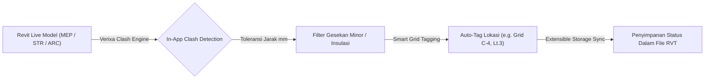

Selamat datang di modul resmi **Verixa Clash**. Mengoordinasikan model arsitektur yang megah dengan instalasi pipa mekanikal, jaringan kabel elektrikal, serta rangka beton/baja struktural kerap memancing ketegangan akibat ribuan bentrokan fisik (*clashes*) di lapangan. 

Secara historis, verifikasi bentrokan membutuhkan ketergantungan penuh terhadap ekspor berkala ke perangkat eksternal (seperti Autodesk Navisworks atau Solibri), memotong ritme iterasi cepat tim drafter Anda. **Verixa Clash** merombak paradigma tersebut.

---

## Deteksi Bentrokan Langsung Di Dalam Revit (True Zero-Export)

Dengan mengusahakan daya komputasi dari API kernel Revit terbaru (2021–2026), **Verixa Clash** memungkinkan penanggung jawab disiplin maupun spesialis BIM Coordinator untuk memvalidasi bentrokan model *saat itu juga secara real-time*, langsung tanpa melangkah ke luar dari antarmuka pita kerja Autodesk Revit Anda.

---

## 4 Pilar Koordinasi Unggulan Verixa Clash

1. **[In-App Clash Detection](/clash/in-app-clash-detection/):** Jalankan kueri pemeriksaan silang (cross-discipline testing matrix) antara kategori model apa pun dalam hitungan detik. Isolasi warna visual hijau (Aman), kuning (Disenggol/Review), dan merah (Bentrokan Kritis) secara otomatis diterapkan pada obyek di *3D Viewport*.
2. **[Toleransi mm](/clash/tolerance-mm/):** Jangan biarkan laporan koordinasi Anda dicemarkan oleh ribuan peringatan keliru yang ditimbulkan oleh persinggungan isyarat tipikal (seperti balutan insulasi pipa HVAC berselisih 2 milimeter dengan penutup plafon eternit). Tentukan batas toleransi jarak mm sesuka Anda.
3. **[Smart Grid Tagging](/clash/smart-grid-tagging/):** Mengakhiri penulisan koordinat bentrokan yang berantakan (seperti `"Clash ID #1092873"` yang tak memberi tahu apa-apa). Algoritma pintar kami mendeteksi sumbu Grid Arsitekural terdekat dan membubuhi label lokasi natural, misalnya: *"Grid B-5, Level 2"*.
4. **[Worksharing Extensible Storage](/clash/worksharing-extensible-storage/):** Hilangkan kerepotan menyertakan file spreadsheet komentar eksternal `.EXCEL` atau berkas BCF. Verixa merajut data riwayat status pemeriksaan tiap bentrokan (*New, Reviewed, Approved, Resolved*) ke dalam relung batin parameter internal file `.RVT` pusat (*Central Model*) menggunakan *Autodesk Extensible Storage Technology*.

---

## Langkah Berikutnya

Silakan eksplorasi penjabaran terperinci di menu sidebar kiri atau bacalah panduan cepat **In-App Clash Detection** untuk segera mengeksekusi pemeriksaan pertama model Anda.
