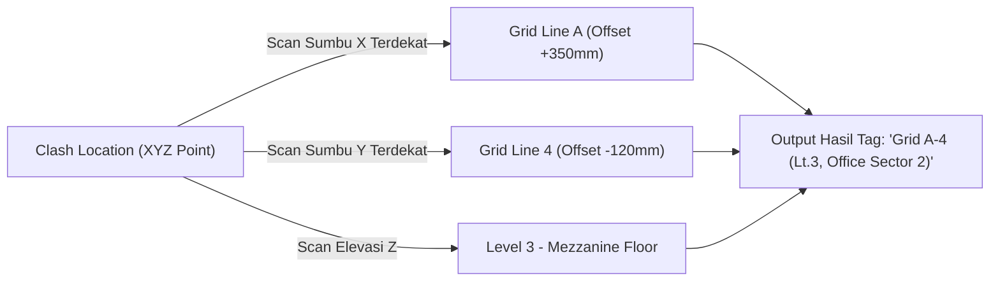

Saat menyerahkan dokumen Laporan Bentrokan (*Clash Report*) kepada Site Manager, Foreman, atau konsultan lapangan di area proyek konstruksi, daftar kode identifikasi acak seperti `"Element ID #44921"` atau `"Clash-4091"` sama sekali tidak aplikatif untuk menuntut tim menemukan titik perbaikan secara nyata.

Fitur **Smart Grid Tagging** oleh Verixa memecahkan krisis komunikasi lokasi ini dengan secara algoritmik menerjemahkan posisi koordinat ruang kartesian $XYZ$ setiap temuan clash menjadi **Alamat Sistem Grid Arsitekural & Elevasi Lantai terdekat** secara otomatis!

---

## Keajaiban Penamaan Lokasi Alamat Otomatis (Smart Addressing)

Ketika temuan clash tercatat ke dalam daftar pemantauan Anda, Verixa menghitung jarak geometrik dari titik pusat persinggungan itu ke seluruh Garis As Grid (*Grid Lines*) horizontal ($X$) dan vertikal ($Y$) serta level referensi vertikal ($Z$) di file Revit.

### Hasil Terjemahan Laporan Lapangan Verixa vs Laporan Tradisional

| Gaya Laporan | Format Contoh Tulisan | Kemudahan Identifikasi Kontraktor Lapangan |
| :--- | :--- | :---: |
| **Standar Bawaan (Generic Revit/CAD)** | `Clash Event #90812 | X:-345.1 Y:192.4 Z:45.0` | ❌ Sangat Buruk (Butuh koordinat komputer di kantor) |
| **Verixa Smart Grid Tagging** | `Grid C-5 (Offset +500mm Ke Utara) - Level 2 Lantai Utama` | ✔️ Sangat Baik & Langsungan Ketemu Di Lokasi Site Proyek |

---

## Fitur Integrasi Serta Keistimewaan

1. **Pengayaan Parameter Otomatis:** Nama alamat grid cerdas ini disalin seketika ke kolom atribut internal dari setiap item laporan clash. Saat Anda menekan tombol ekspor *Generate PDF Report* atau mempublikasikannya ke dalam *Drawing Schedule Table* di Revit, teks alamat ini telah tertancap sempurna dalam tabel kolom.
2. **Pengenalan Sektor & Zona (Zone Awareness):** Jika model bangunan Anda menerapkan parameter zonasi massa (*Revit Scope Box* atau *Massing Rooms* seperti "Tower A", "Podium West", atau "Retail Hall"), Smart Grid akan menambahkan julukan ruangan tersebut di akhir kalimat koordinat (contoh: `"Grid B-2, Level 1 [Lobby Area]"`).
3. **Pembubuhan Penunjuk 3D Tag dalam Pandangan View:** Klik kanan pada sembarang baris alamat clash di panel Verixa dan pilih menu **"Place Location Callout Tag"**. Verixa akan menjahit tanda anak panah teks berspesifikasi parameter asli yang mencantumkan nama grid langsung di denah penampang view Revit Anda.

---

## Cara Mengaktifkan Fitur

1. Di dalam beranda **In-App Clash Detection** Verixa, pastikan pemindaian matriks telah dieksekusi.
2. Klik ikon tombol **⚙️ Options & Formatting** di samping daftar hasil.
3. Beri tanda centang (☑) pada opsi: **"Enable Smart Grid Addressing Auto-Compute"**.
4. Di kolom **Grid Reference Preference**, pilih apakah Anda ingin mencatumkan nilai jarak offset presisi milimeter (misal: `"Grid A-3 + 450mm"`) atau penamaan perapatan pembatas sel terdekat saja (misal: `"Antara Grid A & Grid B, Jalur 3"`).
5. Tekan **Save Preferences**. Seluruh baris di dalam penampang tabel laporan Anda seketika berubah menembakkan koordinat proyek profesional yang gampang dibaca oleh siapapun di lapangan.
