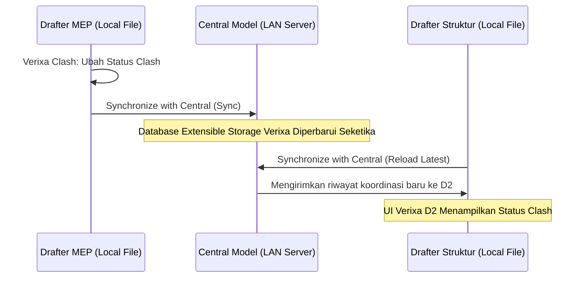

Tantangan terbesar setelah tim berhasil mendeteksi bentrokan model adalah bagaimana mengelola **Riwayat Status Kolaborasi (Status Tracking)**—seperti menandai mana bentrokan yang masih baru (*New*), sedang ditinjau (*Active/Under Review*), diizinkan oleh manajer (*Approved*), atau telah kelar diperbaiki (*Resolved*).

Alur kerja konvensional kerap mewajibkan para koordinator untuk saling melempar file ekstra eksternal bertitel spreadsheet `.EXCEL`, berkas XML `.BCF (BIM Collaboration Format)`, ataupun database terpisah yang rawan hilang, tidak tersinkron, atau versinya usang di server kantor.

**Verixa Clash** menyelesaikan keruwetan ini dari akarnya dengan menjejalkan seluruh database riwayat status koordinasi **langsung ke dalam struktur internal file model Revit Anda (.RVT)**, memanfaatkan kecanggihan teknologi asli dari Autodesk: **Revit Extensible Storage Schema (Ext-Store)**.

---

## Apa Itu Revit Extensible Storage & Mengapa Sangat Unggul?

*Revit Extensible Storage* adalah sebuah kompartemen rahasia, sangat terenkripsi, dan berstruktur relasional murni di dalam database file model `.RVT` resmi dari Autodesk yang memungkinkan pihak pengembang bersertifikasi (seperti Verixa) menyisipkan objek data berkapasitas tinggi langsung ke dalam elemen geometri maupun dokumen master tanpa merusak validitas struktur file.

---

## 5 Manfaat Nyata dalam Alur Kerja Tim Worksharing

### 1. Tanpa File Eksternal yang Tercecer
Selama tim Anda memegang satu berkas `Central_Model.rvt` di komputer LAN kantor atau lewat fasilitas BIM 360/Autodesk Docs, maka 100% data riwayat bentrok Verixa dijamin 100% melekat di dalamnya. Selamat tinggal pada pencarian file `clash_report_revision_V4_final_fix.xlsx`!

### 2. Sinkronisasi Otomatis Lewat "Sync with Central"
Ketika seorang anggota teknisi MEP memotong pipa dan mengesahkan status clash di Verixa menjadi *Resolved (Selesai)*, tekan tombol standar Revit: **Synchronize with Central**. Selamanya, seluruh anggota tim di stasiun kerja lainnya cukup melakukan **Reload Latest** maka panel Verixa di komputer mereka seketika akan mencerminkan pembaruan status tersebut!

### 3. Skema Data Terfragmentasi (Zero Performance Bloat)
Verixa merumuskan struktur penyimpanan *Extensible Storage* kami menggunakan metode **Micro-Payload Compression Chunking**. Menyimpan 10.000 catatan riwayat bentrokan lengkap dengan timestamp dan nama pengguna (*User ID*) hanya memakan kapasitas ekstra sebesar **< 250 Kilobyte (KB)** pada ukuran keseluruhan file Revit Anda!

### 4. Jejak Audit Penanggung Jawab (Audit Trail Log)
Setiap perubahan status tabrakan akan mengarisi parameter catatan permanen di dalam sistem penyimpanan Extensible Storage Verixa:
* **Siapa pengubahnya?** (Mengambil parameter `Windows User Name` / `Revit Username`).
* **Kapan diubah?** (Waktu persis jam, menit, tanggal *Timestamp*).
* **Catatan pesan resolusi (Comments):** Misalnya, *"Sudah digeser turun 30cm di bawah balok utama via pesat RFI #104"*.

### 5. Privasi dan Hak Akses Keamanan
Skema *Extensible Storage* milik Verixa dikawal oleh **Globally Unique Identifier (GUID Security Shield)** mutlak. Aplikasi pihak ketiga yang tidak berizin atau kompetitor tidak akan bisa merusak, memvalidasi ulang, atau mencuri kueri data komentar pengawasan koordinasi tim di dalam proyek Anda.

---

## Cara Melakukan Reset atau Bersih Data (Puring Database)
Jika pada akhir penyelesaian masa proyek bangunan (As-Built Handover) Anda berambisi memurnikan atau menghapuskan segenap catatan jejak riwayat Verixa Clash dari dokumen master sebelum diserahterimakan kepada owner klien:
1. Klik tombol dropdown kecil pada pita **Verixa Clash**.
2. Pilih opsi **"Advanced & Ext-Store Utilities"** &rarr; **"Purge Clash Extensible Storage Database"**.
3. Sistem akan meminta konfirmasi dua kali guna mencegah penghapus keliru. Setelah disetujui, Verixa akan menyulut pembebasan (*wipe*) atas skema memori di file RVT Anda hingga kembali bersih ke 0 KB seperti awal pengaktifan model.
