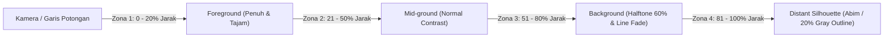

Gambar tampak (*Elevations*) dan potongan (*Sections*) orthographic di dalam model BIM sering kali terlihat monoton dan datar karena seluruh elemen arsitektur, tidak peduli apakah objek tersebut berjarak 2 meter di depan atau 40 meter jauh di latar belakang, diposisikan oleh sistem dengan ketebalan dan kontras kehitaman garis yang persis sama (homogen).

**Elevation Depth-Styling** merekonstruksi kekurangan ini dengan memperkenalkan otomatisasi **4-Layer Depth Cueing & Halftone Silhouette Mapping** berorientasikan jarak 3D ke pandangan gambar kerja 2D Anda dalam satu sentuhan instan.

---

## Konsep 4-Layer Architectural Depth Zoning

Alasan utama mengapa gambar presentasi para arsitek terkemuka memiliki estetika mendalam yang menawan adalah penerapan ilusi perspektifik atmosfir (degradation of detail based on distance). Verixa memecah volume jarak pandang (View Depth Clip) Anda menjadi 4 zona berurutan:

1. **Zona 1 - Foreground (0% - 20% Jarak Clip):** Lapisan elemen yang berada paling dekat dengan kamera atau tepat tersayat oleh bidang potong (Section Cut-Plane). Digambarkan dengan **garis siluet hitam super tebal** (contoh: ketebalan pena 0.70mm) dan arsiran pola potongan bersaturasi 100% pekat.
2. **Zona 2 - Mid-ground (21% - 50% Jarak Clip):** Lapisan fasad utama bangunan atau bidang dinding primer yang ditinjau. Dibanderol dengan **garis batas normal** (ketebalan pena 0.25mm) dan tekstur material eksterior utuh.
3. **Zona 3 - Background (51% - 80% Jarak Clip):** Elemen pendukung, seperti menara belakang, tangga lingkar sekunder, atau pepohonan lansekap interior. Sistem memberlakukan efek *Halftone Override* turun ke intensitas **60% Grayscale** dan menghalau arsir pola permukaan berlebih agar tidak merusak fokus mata penikmat gambar.
4. **Zona 4 - Distant Silhouette / Horizon (81% - 100% Jarak Clip):** Gedung-gedung tetangga, deret pepohonan perkotaan batas site, atau pegunungan di batas paling belakang. Ditampilkan sebagai **sketsa siluet abu-abu transparan 20% yang pudar**, menghanyutkan diri secara manis ke latar belakang langit putih/kosong.

> [!TIP]
> **Kombinasi Bayangan Dinamis**: Fitur ini secara otomatis juga mengontrol rasio parameter *Cast Shadows* dan *Ambient Shadows* khas Revit, menanamkan kelembutan gradasi kontras bayangan matahari alami di sekitar kusen jendela dan tonjolan fasad kanopi Anda.

---

## Panduan Pengaturan dan Penerapan

1. Buka View Tampak Depan (*South / North Elevation*), Tampak Samping, atau gambar Potongan (*Building Section*) apa pun di project Anda.
2. Pada tab Verixa Suite di Pita Menu Revit, tekan icon **Elevation Depth-Styling**.
3. Di dalam baki kontrol, tentukan berapa meter jarak total kedalaman pemotongan panduan view Anda jika Anda belum mengaktifkan *Far Clip Settings*.
4. **Pilih Tema Gaya Presentasi:**
   * **Classic White Architectural Study:** Latar belakang kertas bersih beralih gradasi kontras pena hitam-ke-abu abu.
   * **Warm Horizon Competition Concept:** Menambahkan semburat bayangan gradasi keemasan sore hari (*Sunset ambient styling*) pada dinding eksterior dan langit horizon.
   * **High-Contrast Dark Ink presentation:** Menyamarkan elemen latar belakang sedominan mungkin agar fokus terpaut 100% pada struktur kantilever baru di baris terdepan.
5. Geser slider *Depth Transition Softness* antara angka **1 (Sangat Terjal)** hingga **5 (Gradasi Amat Mulus & Kabut)** sesuai preferensi selera kreatif Anda.
6. Tekan tombol **Apply Depth-Styling Override**. 

> [!NOTE]
> Anda bisa menyimpan pengaturan ini menjadi **Revit View Template** bawaan proyek secara otomatis melalui tombol tambahan *Save as View Template* di baki Verixa, sehingga puluhan gambar potongan lainnya di seluruh dokumen BIM Anda bisa mewarisi keindahan estetika yang identik seketika.
