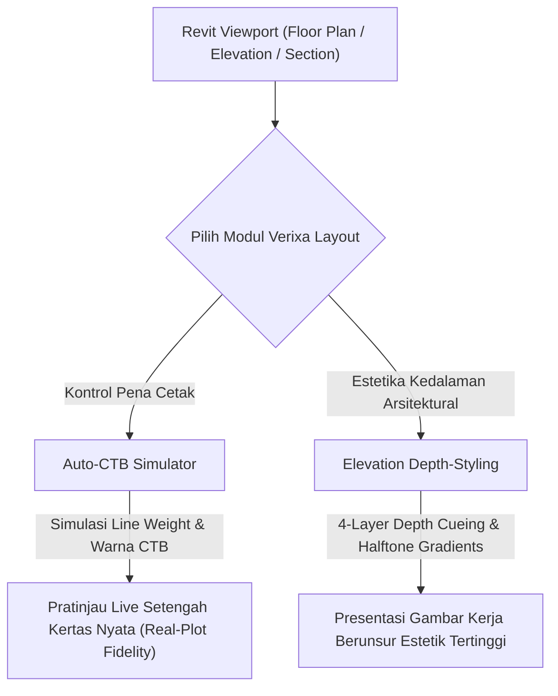

Selamat datang di modul panduan resmi **Verixa Layout**. Dalam ekosistem Building Information Modeling (BIM) modern, menghasilkan model 3D berdata lengkap tidaklah cukup; kita juga dituntut menghasilkan lembaran kerja cetakan fisik atau berkas PDF yang menakjubkan secara visual, tajam, dan mudah terbaca oleh pengawas di lapangan konstruksi.

**Verixa Layout** menjembatani kesenjangan antara keringan visual data 3D dengan keanggunan presentasi seni gambar kerja (*architectural drafting art*) khas profesional.

---

## Filosofi "Plot yang Sempurna" (The Perfect Plot)

Banyak pengguna beralih dari program gambar 2D (seperti AutoCAD atau Rhino) menuju Revit mengalami kesulitan besar dalam mengontrol ketebalan garis cetak (*Line Weights*), hierarki bidang kedalaman visual (*Depth & Contrast*), dan siluet obyek. 

Seringkali, untuk mengetahui apakah sebuah instalasi dinding dan jendela kelihatan terlalu tebal, gelap, atau bertabrak dengan blok teks saat dicetak ke ukuran kerta A0/A1, drafter harus berulang kali mengimpornya menjadi PDF tes, memakan waktu hingga berjam-jam kerja yang tak produktif.

---

## Alat Andalan Verixa Layout

Modul Layout Verixa mentransformasi standar grafis dokumen Revit Anda lewat 2 instrumen unggulan:

* **[Auto-CTB Simulator](/layout/auto-ctb-simulator/):** Untuk pertama kalinya, hadirkan alur kerja terjemahan ketebalan pena, degradasi skala warna, dan kebiasaan file konspirasi CTB standar AutoCAD murni ke tampilan monitor proyek Revit Anda sebelum dilakukan export/cetak kertas.
* **[Elevation Depth-Styling](/layout/elevation-depth-styling/):** Ciptakan ilusi dimensi 3D dramatik pada potongan proyek (section) maupun tampak depan rumah/gedung (elevation) melalui pengacuan kontras kabut belakang laut (*depth cueing*), siluet kontur garis tebal, dan bayangan abu-abu lembut (*halftone shadow mapping*) secara otomatis.

---

## Siap Meningkatkan Kualitas Karya Grafis Anda?
Silakan pilih topik panduan fitur teknikal dari daftar navigasi produk Verixa Layout di sebelah kiri Anda.
