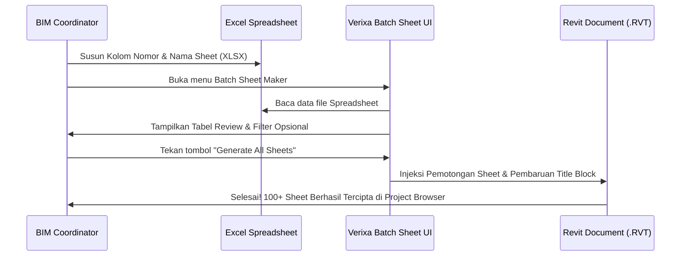

**Batch Sheet Maker** adalah solusi utama untuk mengubah tugas menyinkronisasi dan membuat puluhan lembar gambar teknikal dari jadwal *Drawing List* menjadi sebuah tugas hitungan detik yang presisi dan bebas kesalahan input manusia.

Alatan ini menampilkan antarmuka berbasis **WPF (Windows Presentation Foundation)** yang sangat responsif, mendukung integrasi langsung dengan spreadsheet modern (`.XLSX`, `.CSV`), dan mampu mengisi nilai parameter kustom pada *Title Block / Kop Gambar* saat perumusan awal.

---

## Fitur Utama Batch Sheet Maker

* **Impor Daftar Gambar Excel:** Baca tabel spreadsheet yang berisi kolom *Sheet Number*, *Sheet Name*, dan *Title Block Family Type*.
* **Otomasi Pemetaan Title Block:** Pilih format standar kertas (A0, A1, A3, dst.) untuk diterjemahkan secara dinamis ke tiap baris sheet baru.
* **Injeksi Parameter Kustom:** Sampaikan parameter unik seperti *Drawn By*, *Checked By*, *Approved By*, atau *Revision Date* dari kolom tabel excel ke properties kop gambar secara otomatis.
* **Pematok Kode Prefix & Suffix:** Tambahkan awalan disiplin ilmu seperti `ARC-`, `MEP-`, atau `STR-` pada kumpulan nomor sheet yang diplikasi berantai dengan satu sentuhan kursor.

---

## Alur Kerja Langkah demi Langkah

### Langkah 1: Persiapkan Data Master di Excel
Buat dokumen spreadsheet excel dengan format kolom sederhana seperti berikut:
| Sheet Number | Sheet Name | Title Block Type | Drawn By |
| :---: | :--- | :---: | :---: |
| A-101 | Denah Lantai Dasar | A1 - Standard Kop Office | AGS |
| A-102 | Denah Lantai 1 | A1 - Standard Kop Office | AGS |
| A-201 | Tampak Depan & Belakang | A1 - Standard Kop Office | Budi |
| A-301 | Potongan Memanjang A-A | A0 - Landscape Special | Joko |

### Langkah 2: Eksekusi Melalui Antarmuka Batch Sheet Maker
1. Jalankan perintah **Batch Sheet Maker** melalui tab ribbon Verixa di Revit Anda.
2. Pada panel atas UI, tekan tombol **Import from Excel / CSV** dan pilih file yang telah disiapkan.
3. Seluruh baris data akan termuat di dalam grid tampilan pratinjau interaktif.
4. (Opsional) Jika terdapat sel yang keliru atau perlu dimodifikasi mendadak, Anda dapat mengklik sel di dalam grid tampilan Verixa dan langsung memperbaikinya secara live (berkat integrasi modul **BulkEditWindow** kami).
5. Pastikan menu *Title Block Default Mapping* di sebelah kanan atas menunjuk pada tipe kop yang tersedia pada berkas proyek Anda.
6. Tekan tombol utama **Generate Sheets**.

> [!NOTE]
> Jika sistem mendeteksi ada nomor lembaran (Sheet Number) yang tumpang tindih (mengalami duplikasi dengan sheet yang sudah ada sebelumnya di dalam *Project Browser*), indikator sel baris tersebut akan berubah menjadi warna kuning kehampaan dengan opsi merombak atau melekatkan akhiran (suffix) secara otomatis.
