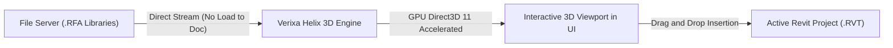

**Family Manager** adalah revolusi cara Anda mengelola dan menavigasi ribuan aset file **Revit Family (.RFA)** di stasiun kerja dan server lokal LAN kantor Anda. 

Berbeda dari program penelusuri famili biasa yang harus membuka setiap file di latar belakang Revit (mengakibatkan jeda waktu atau "freezing"), Verixa mengoperasikan mesin rendering pratinjau mandiri bertenaga **Helix Toolkit 3D Direct3D 11**.

> [!TIP]
> **Tanpa Memori Proyek Terbuang**: Pratinjau visual geometri 3D, kueri parameter, serta pemeriksaan daftar tipe famili berjalan sepunuhnya di luar utas (thread) RAM Revit, sehingga model Anda terhindar dari file cache sampah yang memperbesar ukuran file `.RVT`.

---

## Keunggulan Teknologi Helix Toolkit 3D

1. **Rotasi & Zoom 3D 60 FPS:** Jelajahi geometri detail dari perabot arsitektur, pompa mekanikal MEP, hingga baja profil struktural dengan kontrol navigasi zoom, pan, dan orbit sekickap mouse bergaya fluid.
2. **Inspeksi Parameter Tanpa Buka File:** Baca daftar lengkap parameter dimensi (*Length, Width, Height*), spesifikasi bahan material, dan data identitas (*OmniClass, IFC Parameters*) langsung pada panel informasi samping.
3. **Pemuatan Berdaya Cepat (Drag & Drop):** Cukup klik dan seret (drag) model dari viewport Helix 3D langsung ke kanvas model 3D atau Floor Plan di Autodesk Revit Anda untuk penempatan langsung.

---

## Panduan Pengoperasian

### 1. Memindai & Menambahkan Direktori Pustaka (Indexing)
1. Pada Ribbon Verixa, klik tombol **Family Manager**.
2. Klik ikon folder **Add Library Path** di sudut atas antarmuka manager.
3. Pilih folder di stasiun kerja Anda atau mapped-network drive server (misal: `Z:\BIM Standards\RMA Library`).
4. Mesin pengindeksan Verixa akan mendeteksi file RFA di belakang layar dan menghasilkan database katalog instan.

### 2. Memanipulasi Viewport 3D Helix
Di dalam jendela utama pratinjau:
* **Tombol Kiri Mouse (Klik & Geser):** Memutar (orbit) sudut pandang famili 3D dalam 360 derajat.
* **Scroll Wheel (Roda Mouse):** Memperbesar atau memperkecil (zoom in/out) tampilan komponen.
* **Tombol Kanan Mouse (Klik & Geser):** Menggeser posisi sumbu tengah (*Pan View*).
* **Toggle Shading & Wireframe:** Anda dapat menekan ikon kubus di atas viewport untuk beralih dari tampilan Shaded, Realistic, hingga kerangka Wireframe.

---

## Pemotongan Berantai (Batch Family Upgrade)
Dilengkapi juga dengan alat **Batch Upgrade**, memungkinkan Anda menaikkan versi file pustaka lama (contoh: ribuan file Revit 2021) ke versi proyek Anda saat ini (Revit 2026) secara simultan saat malam hari tanpa intervensi pengguna.
